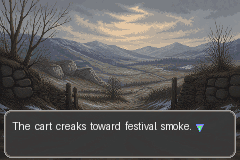
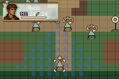

# Winternight — a 100% vibe-coded tactical RPG proof of concept

> **This repository is 100% vibe coded.** A human supplied the product direction,
> story boundary, taste decisions, and play feedback; coding agents produced the
> implementation, structured adaptation, compiler, tests, generated-art pipeline,
> procedural audio, and documentation through iterative prompts. It is a technical
> proof of concept, not a finished or licensed game.

Winternight is a story-driven, GBA-inspired tactical RPG vertical slice built with
[Lex Talionis](https://gitlab.com/rainlash/lt-maker). It asks whether agents can turn
structured story and mission specifications into a deterministic, playable game
without hand-editing the generated `.ltproj` files.

The current source builds four connected chapters covering the opening setup through
the end of Winternight. It establishes Rand's home and friends before the attack,
shows Tam protecting him, presents an explicitly inferred defense of Emond's Field,
and ends when Rand returns to wounded Tam with supplies—before later revelations.

## See it in motion

| Story scenes | Tactical gameplay | Reused locations, changed by the story |
| --- | --- | --- |
|  |  |  |

## What this POC proves

- Structured YAML for canon beats, scenes, missions, maps, characters, and assets can
  compile into a playable Lex Talionis project.
- Deterministic Python—not an LLM improvising inside engine files—creates the game.
- Four chapters and 37 authored scenes reuse two tactical layouts across four distinct
  narrative states.
- Original AI-generated portraits and backgrounds pass a deterministic processing and
  provenance pipeline.
- Three original music tracks and four sound effects are synthesized, hash-locked, and
  registered with the engine.
- A real-input automated run completes the entire campaign, including menus, combat,
  objectives, saves, chapter transitions, and the ending card.
- An unrelated one-chapter fixture compiles through the same code, demonstrating that
  the compiler is not limited to Winternight.

## Quick start on Linux

Requirements: Git, `uv`, and common SDL/X11 runtime libraries. `uv` installs the pinned
Python 3.11 environment. FFmpeg with Vorbis support is required only when regenerating
music or sound effects, not when compiling or playing the committed tracks.

```bash
git clone --recurse-submodules https://github.com/chrishart0/winternight-rpg.git
cd winternight-rpg
make bootstrap
make compile
make play
```

Run the complete verification portfolio with:

```bash
make check
```

That suite validates schemas and references, runs 60 tests, loads all four chapters in
the pinned engine, drives a full campaign with real pygame input, checks save/continue
and game-over recovery, verifies deterministic output, captures 46 in-engine frames,
loads the project in LT-Maker, and smoke-tests an isolated package.

## How it works

```text
canon and character data
          ↓
story beats and adaptation decisions
          ↓
campaign, mission, scene, map, and asset specifications
          ↓
schema and cross-reference validation
          ↓
deterministic Lex Talionis compiler + asset/audio pipelines
          ↓
generated build/winternight.ltproj
          ↓
engine, input, visual, packaging, and determinism checks
```

The central rule is: **agents author structured specifications; deterministic code
authors the game project.** Generated files under `build/` are disposable and are
never edited by hand.

The source-of-truth narrative pass is documented in
[`docs/story-pass.md`](docs/story-pass.md). Current phase gates and hash-bound evidence
are recorded in [`EXEC_PLAN.md`](EXEC_PLAN.md).

## Command surface

- `make bootstrap` — initialize the pinned LT-Maker submodule and Python environment.
- `make validate` — validate source specifications and internal references.
- `make compile` — recreate `build/winternight.ltproj` deterministically.
- `make play` — compile and launch the generated campaign.
- `make web-build` — create the Pygbag WebAssembly site for static browser hosting.
- `make web-serve` — build and serve the browser target locally for manual testing.
- `make smoke` — exercise chapters, scenes, events, and objective scenarios.
- `make capture` — render title, map, and every authored-scene evidence frame.
- `make input-playthrough` — complete all four chapters using real keyboard input.
- `make music` / `make sfx` — regenerate deterministic original audio with FFmpeg.
- `make portability` — compile and smoke-test the independent Signal Lantern pack.
- `make package` — create a local evaluation archive under ignored `dist/`.
- `make report` — regenerate the hash-bound build report.
- `make check` — run the complete validation and runtime portfolio.
- `make clean` — remove generated build and cache files.

The original Phase 0 engine fixture remains reproducible with `make compile-minimal`.
The story-neutral interface is also available directly:

```bash
uv run --python 3.11 storygen compile-pack \
  --content-root tests/fixtures/signal-lantern \
  --output build/signal-lantern.ltproj
```

The experimental browser target and its S3 publication boundary are documented in
[`docs/web.md`](docs/web.md).

## What “100% vibe coded” means here

This was intentionally built as an agent-development experiment. The human did not
quietly write the implementation between prompts. Instead, agents were given goals,
constraints, screenshots, failures, and taste feedback, then asked to inspect, design,
implement, test, and revise the repository. Different agents owned narrative, engine
integration, verification, visuals, and music work; deterministic tools were used for
the parts that must be repeatable.

The phrase does **not** mean “zero human involvement.” The human remained the director
and final taste-maker. It means the artifact itself was produced through agentic coding
and content-generation loops as the subject of the POC.

## Current limitations

- Three timed human playthroughs are still needed to confirm the 45–75 minute target
  and tune subjective difficulty, tutorial clarity, and audio balance.
- Generic civilians and tactical map sprites remain graybox assets.
- The repository pins an actively developed engine commit and intentionally isolates
  all engine-specific serialization behind an adapter.
- The generated Linux package is for local evaluation and is not published as a game
  release.

## Unofficial fan POC and provenance

This is an unofficial, noncommercial fan-made technical experiment. It is not endorsed
by or affiliated with the author, publishers, rights holders, television production,
or any game studio connected to *The Wheel of Time* or *Fire Emblem*. Do not treat this
repository as permission to distribute a Wheel of Time adaptation.

The repository contains no novel text or substantial source excerpts. Dialogue is new
paraphrase. Visual assets were generated without actor, television-adaptation, or
Fire Emblem asset references; prompts, processing versions, and hashes are recorded in
the asset manifests. Music and sound effects are original deterministic synthesis.
Private source notes, saves, generated projects, and packaged builds are gitignored.

Lex Talionis and every dependency remain governed by their own upstream licenses. The
pinned engine is a Git submodule rather than copied source. See
[`docs/THIRD_PARTY_NOTICES.md`](docs/THIRD_PARTY_NOTICES.md) for the current notices.
